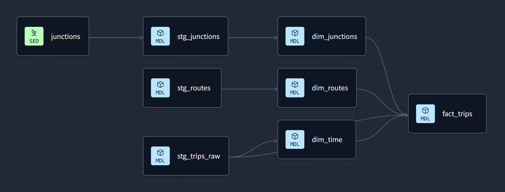

# Smart Dublin Traffic Insights: End-to-End Data Pipeline for Journey Time Insights

## 🚀 Live Dashboard

You can explore the interactive visualisations here:  
👉 [**Launch the Dashboard**](https://smart-dublin-traffic-insights.streamlit.app/)


## 🚦 Project Overview

**Smart Dublin Traffic Insights** is a cloud-based data engineering solution that processes and analyses journey times across Dublin City. This pipeline automates the extraction of traffic data from Dublin City Council’s trip system, transforms it into analytics-ready formats, and delivers insights via an interactive Streamlit dashboard. The goal is to empower urban planners, transport authorities, and commuters with data-driven traffic insights.

## 🎯 Problem Statement

Monitoring and analyzing traffic journey times is crucial for:
- Urban planning and infrastructure development
- Real-time traffic management
- Commuter route optimization
- Transportation policy evaluation

However, processing raw traffic data presents challenges:
- Data comes in timestamped CSVs requiring consistent processing
- Journey times need correlation with time, date, and location factors
- Raw data requires cleaning and transformation before analysis

**Smart Dublin Traffic Insights** addresses these challenges by:
1. Automating data extraction from [Smart Dublin's journey time dataset](https://data.smartdublin.ie/dataset/journey-times-across-dublin-city-from-dublin-city-council-traffic-departments-trips-system)
2. Storing raw data in **AWS S3 as a data lake**
3. Processing and modeling data in **Redshift using dbt**
4. Orchestrating the pipeline with **Airflow (via Astronomer)**
5. Delivering insights through an interactive **Streamlit dashboard**

## 🏗️ Architecture and Highlights


### Solution Highlights:

✅ **Cloud-Native Infrastructure**: Leverages AWS services (S3, Redshift, IAM) with Terraform IaC for reproducible deployments

✅ **Modern Data Stack**: Combines S3 (data lake), Redshift (warehouse), dbt (transformation), and Airflow (orchestration)

✅ **dbt Cloud Integration**: Utilizes dbt Cloud for collaborative data modeling with CI/CD capabilities

✅ **Astronomer for Airflow**: Production-ready orchestration with monitoring

✅ **Interactive Visualization**: Streamlit dashboard enables exploratory data analysis of journey times

## 🚀 Infrastructure Setup with Terraform

The project uses **Terraform** to provision AWS resources following Infrastructure as Code (IaC) principles.

### 🛠️ Prerequisites
- Terraform v1.11+
- AWS account with admin privileges
- AWS CLI configured

### 🔑 Authentication
Create a file called 'credentials' inside '.aws' folder in the root directory with the following text.
```bash
[dev]
aws_access_key_id="your_access_key"
aws_secret_access_key="your_secret_key"
```
### 🏗️ Provisioning Resources
```bash
cd terraform/
terraform init
terraform plan
terraform apply
```
This creates:
- S3 bucket for raw data storage
- Redshift Serverless cluster
- IAM roles for Redshift-S3 access
- Required security groups

## 🔄 Data Pipeline Components

### 1\. Data Ingestion (S3)
- `download_raw_data.py`: Downloads CSVs from Smart Dublin portal
- `upload_files_to_s3.py`: Formats, cleans, and uploads files to S3

### 2\. Redshift Loading
- `load_s3_to_redshift.py`: Loads cleaned files from S3 into redshift

### 3\. Data Transformation (dbt Cloud) 
1. **Staging Layer:**
    - Cleans raw data (handling nulls, standardizing formats)

2. **Mart Layer:**
    - `fact_trips`: Trip metrics
    - `dim_routes`: Route characteristics
    - `dim_time`: Date/Time breakdown
    - `dim_junctions`: Junction metadata


    
  **dbt Cloud Features:**
  - Scheduled runs via API
  - Automated documentation
  - CI/CD for model changes

## ⚡ Orchestration with Airflow (Astronomer)
The pipeline is orchestrated using Apache Airflow deployed via Astronomer for production-grade scheduling.

### Key DAG:
**`dublintrips_dag:`** Orchestrates all python scripts and triggers the dbt Cloud job.
- Downloads raw_data csv files from Smart Dublin Open data portal
- Formats, cleans, and uploads cleaned data files into S3.
- Loads S3 files into Redshift.
- Triggers dbt Cloud job via API for data transformations

## 📊 Streamlit Dashboard
The interactive dashboard provides comprehensive analysis of Dublin traffic patterns using the ~~latest~~ batch-processed data, with multiple visualization layers and filtering capabilities.

### Key Features:

#### 📊 **Batch Analytics Dashboard**
Calculated metrics based on the ~~most recent~~ batch processing:
  - Total trips in selected period
  - Average travel time across routes
  - Peak traffic hours identification
  - Busiest routes

#### 🕒 **Temporal Analysis of Processed Data**
- Hourly travel time patterns
- Daily/weekly traffic volume trends
- Time-based distribution analysis

#### 🗺️ **Geospatial Insights**
- Junction pair analysis (origin-destination)
- Top start/end junctions by traffic volume
- Route performance comparisons

### Dashboard Components:

#### I. **Interactive Filters: Sidebar controls**
  - Date range
  - Time range
  - Trip type
  - Route

#### II. **Visualization Tabs**
**📈 Time Patterns Tab**
- Hourly travel time trends
- Peak hour identification
- Weekly patterns visualization
- Travel time distribution analysis

**🚏 Junctions Tab**
- Common junction pairs analysis
- Top 10 start/end junctions

**🛣️ Route Analysis Tab**
- Slowest routes identification
- Route performance over time

**📊 Data Tab**
- Filtered data preview
- CSV export functionality

### Dashboard Screenshots
#### Hourly travel time trends


#### Common Junctions Pairs


#### Slowest routes identification


## 🛠️ Reproducibility
**⚠️ Note: You need a dbt cloud account with 'teams' plan in order to run dbt cloud job via API. The Airflow dag is specifically implemented for triggering dbt cloud job, and hence will not work with dbt core project.**
### 1. Installations
#### I. Install Terraform
```bash
wget -O - https://apt.releases.hashicorp.com/gpg | sudo gpg --dearmor -o /usr/share/keyrings/hashicorp-archive-keyring.gpg

echo "deb [arch=$(dpkg --print-architecture) signed-by=/usr/share/keyrings/hashicorp-archive-keyring.gpg] https://apt.releases.hashicorp.com $(lsb_release -cs) main" | sudo tee /etc/apt/sources.list.d/hashicorp.list

sudo apt update && sudo apt install terraform
```
#### II. Install Astro CLI (for Airflow)
```bash
curl -sSL install.astronomer.io | sudo bash -s
```

### 2. Infrastructure Setup
```bash
cd terraform/
terraform init
terraform plan
terraform apply
```
### 3. Environment Configuration
#### I\. Create a file called 'credentials' inside '.aws' folder in the root directory with the following contents.

`.aws/credentials`
```bash
[dev]
aws_access_key_id="your_access_key"
aws_secret_access_key="your_secret_key"
```
#### II\. Create a '.env' file inside 'airflow' folder with the following contents:

`airflow/.env`
```bash
REDSHIFT_HOST="your_redshift_host_name"
REDSHIFT_PORT="your_redshift_PORT"
REDSHIFT_DB="your_redshift_DB"
REDSHIFT_USER="your_redshift_USER"
REDSHIFT_PASSWORD="your_redshift_PASSWORD"
S3_BUCKET="your_S3_bucket_name"
IAM_ROLE_ARN="your_IAM_role_arn"
```
#### III\. dbt Cloud Setup:
- Push this repo to Github and connect to dbt cloud.
- Configure Redshift connection and deployment environment
- Create a job (leave Scheduling off).

#### IV\. Streamlit Setup:
Install requirements.txt
```bash
cd streamlit_dashboard
pip install -r requirements.txt
```
Create 'secrets.toml' file inside '.streamlit' folder in the streamlit_dashboard directory with the following contents:

`streamlit_dashboard/.streamlit/secrets.toml`
```bash
[redshift]
url="redshift+psycopg2://<your_redshift_user>:<your_redshift_password>@<your_redshift_host>:<your_redshift_port>/<your_redshift_DB>
```

### 4. Run Airflow DAG
Run the following commands to run Airflow project:
```bash
cd airflow
astro dev start
```
Trigger DAG from the Airflow UI.

### 5. Run Streamlit (Dashboard) app
```bash
cd streamlit_dashboard
streamlit run dashboard.py
```

## 📚 Resources
- [Smart Dublin Data Source](https://data.smartdublin.ie/dataset/journey-times-across-dublin-city-from-dublin-city-council-traffic-departments-trips-system)
- [AWS docs](https://docs.aws.amazon.com/)
- [Terraform Docs](https://registry.terraform.io/providers/hashicorp/aws/latest/docs)
- [dbt Cloud Documentation](https://docs.getdbt.com/docs/get-started-dbt)
- [Astronomer Documentation](https://www.astronomer.io/docs/astro/)
- [Streamlit Documentation](https://docs.streamlit.io/get-started/installation)

---
**This project was developed as part of the [Data Engineering Zoomcamp 2025](https://github.com/DataTalksClub/data-engineering-zoomcamp). Many thanks to DataTalkClub for an amazing learning journey.**